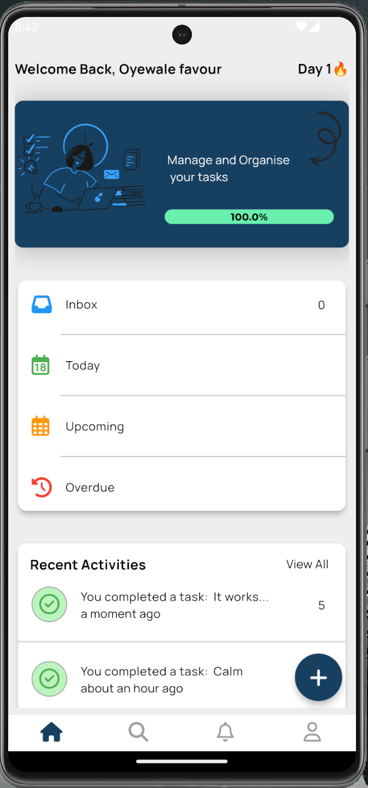

# 🌟 Task Groove

**Task Groove** is a productivity-boosting mobile application built with Flutter, designed to help you manage your tasks, stay organized, and groove through your day with ease.

---

## 🚀 Features

- 📋 **Effortless Task Management:** Add, edit, and delete tasks seamlessly.  
- 🔔 **Custom Notifications:** Never miss a deadline with built-in reminders.  
- 🌈 **Intuitive UI:** Enjoy a sleek and user-friendly interface designed for simplicity.  
 

---

## 🛠️ Tech Stack

- **Flutter:** The modern framework for crafting beautiful, natively compiled applications for mobile.  
- **Firebase:** For authentication, database, and push notifications.  
- **Dart:** The programming language powering Flutter apps.  

---

## 📸 Screenshots

### Home Screen


### Productivity Page


---

## 🏁 Quick Start

### Prerequisites

- Install Flutter SDK on your machine.  
- Set up Android Studio or Xcode for app development.  
- Configure a Firebase project for the app.

### Installation

1. Clone this repository:
   ```bash
   git clone https://github.com/your-username/task_groove.git
   ```

2. Navigate to the project folder:
   ```bash
   cd task_groove
   ```

3. Install dependencies:
   ```bash
   flutter pub get
   ```

4. Run the app:
   ```bash
   flutter run
   ```

---

## 🔧 Configuration

### Firebase Setup
1. Create a new project in the [Firebase Console](https://console.firebase.google.com/).
2. Download the `google-services.json` (for Android) and `GoogleService-Info.plist` (for iOS) files.


### Kotlin Version
Update your Kotlin version in `build.gradle`:
```gradle
ext.kotlin_version = '1.9.10'
```

---

## 🤝 Contributing

Contributions are welcome! Here’s how you can get started:

1. Fork the repository.
2. Create a new branch for your feature or bug fix.
3. Commit your changes and open a pull request.

---


**Ready to take control of your tasks? Start grooving with Task Groove today!**

